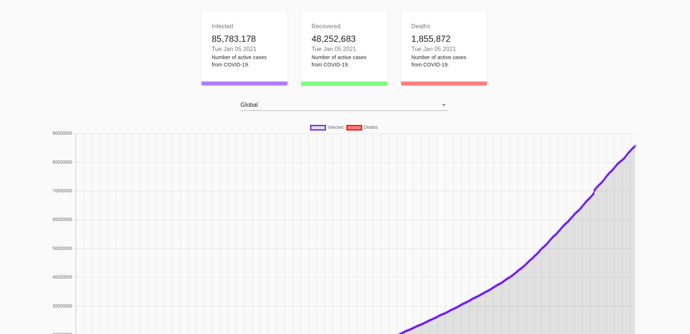

# COVID-19 Tracker

## Installation

Use the package control version [git](https://git-scm.com/downloads) and [node](https://nodejs.org/en/).

```bash
git clone https://github.com/Victor1890/Covid_19-tracker.git
```

```bash
cd Covid_19-tracker
```


## Library using in the project

1. [Axios](https://github.com/axios/axios)
2. [Chart Js](https://www.chartjs.org/)
3. [React Chart-2](https://github.com/reactchartjs/react-chartjs-2)
4. [ClassNames](https://github.com/JedWatson/classnames)

## Usage

Using VSCode like IDE, open the `COVID_19-tracker` run the following commands

In order to install the dependencies

```bash
npm install
```

In order to start in mode development

```bash
npm start
```

## Screenshot



## License
[MIT](https://choosealicense.com/licenses/mit/)